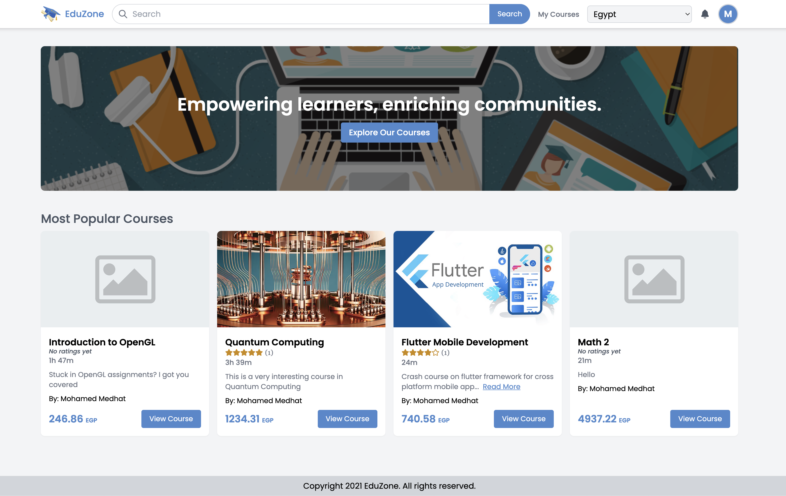
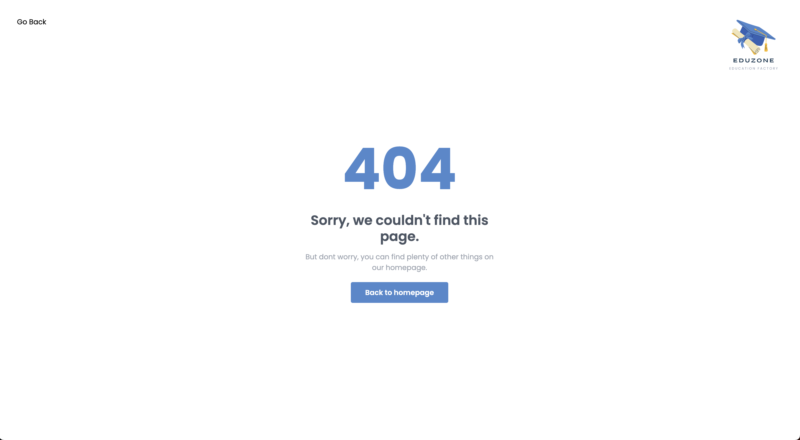
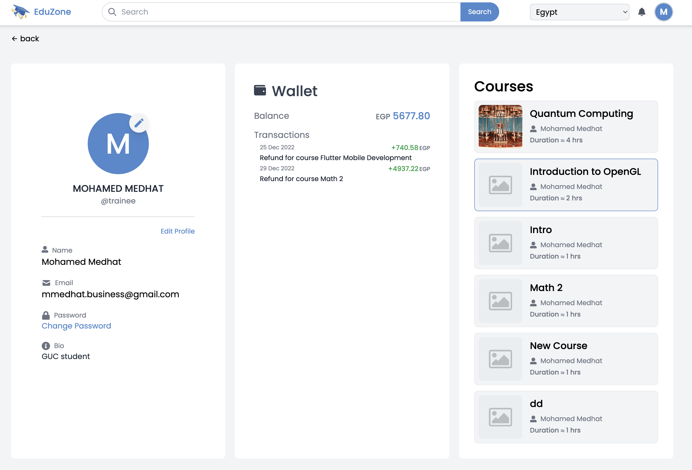
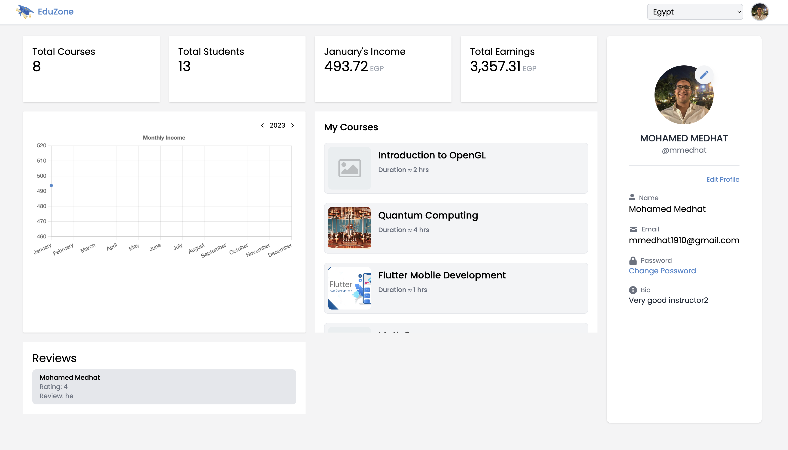
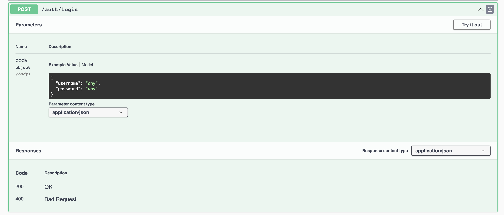
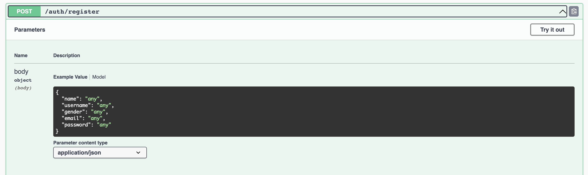
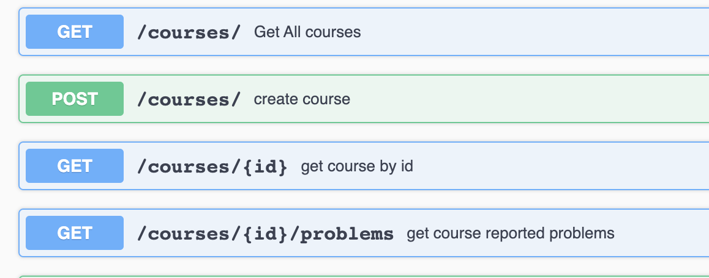
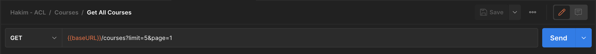
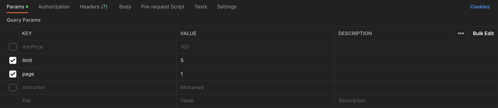
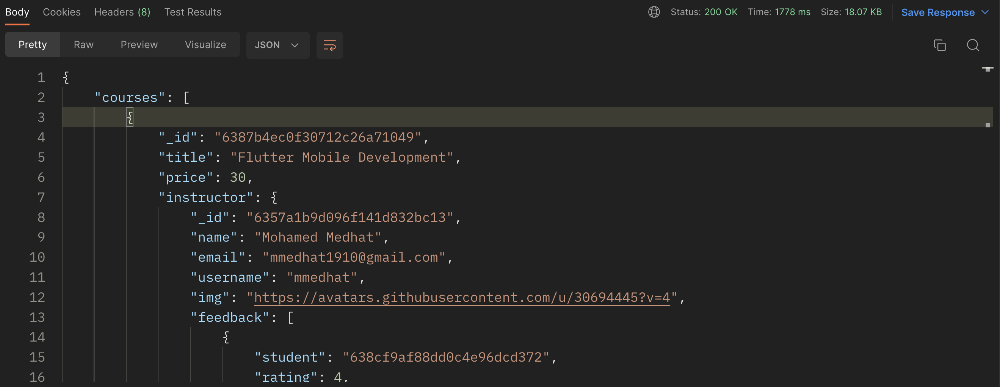

# EduZone

Eduzone is a dynamic online learning platform that empowers trainees to pursue their educational goals, instructors to share their expertise, and businesses to invest in the professional development of their employees. With an intuitive interface and a wide range of courses, Eduzone offers a unique opportunity for all users to expand their knowledge and skills in an engaging and flexible environment.

## Motivation

Eduzone was founded with the vision of fostering the sharing of knowledge and expertise among educators and learners globally, while also providing a premium experience for all users. Our platform was designed to facilitate the exchange of ideas and insights, and to create a seamless and enjoyable learning environment.

## Build Status

### Project Status

Eduzone is currently in the development phase, during which we are actively creating and improving the various features of the platform.

### Bugs and issues are being fixed

- Some frontend components redirect to different pages then what it should be
- Some menus are not working properly
- Students cannot view the correct answers to an exercise

## Code Style

The Eduzone project is structured with a frontend and backend. The backend consists of API routes that are divided into routes and their corresponding controllers/services, and database models that are implemented using mongoose schemas. The frontend is divided into pages and components, with pages containing the overall page structure and individual components, and components including both common components and components specific to various entities and features. The frontend state is managed using the redux state management system and is persisted in local storage to prevent data loss. The entire project is built using the TypeScript language to ensure type safety and bug-free development. The project is also maintained using tools such as husky, eslint, and prettier to ensure that all commits adhere to established formatting standards and undergo type checking before being executed.

## Screenshots






## Framework

The framework used in development is the MERN stack.
The MERN stack is a popular stack of technologies for building web applications. It consists of four main components:

1. MongoDB: A NoSQL database that stores data in a flexible, JSON-like format.
2. Express: A web application framework for Node.js that is used to build the backend of a web application.
3. React: A JavaScript library for building user interfaces.
4. Node.js: A JavaScript runtime that allows developers to run JavaScript on the server-side.

## Technologies

1. Tailwindcss
2. Redux
3. Typescript

## Features

You can find the features in the [FEATURES](FEATURES)

## Extra Features

- User authentication and authorization
- User profile management
- Admin dashboard
- Instructor dashboard
- Statistics Routes

## Code Example

As the project is already huge so we can check a sample of the code, for example the simple course card component:

```tsx
<div
  className="flex  w-full bg-gray-100 rounded-lg p-2 border gap-4 hover:border-primary cursor-pointer transition-all duration-300 ease-in-out"
  onClick={() => navigate(`/courses/${course._id}`)}
>
  
  <div className=" w-full py-1">
    <div className="flex justify-between w-full mb-2">
      <div className="text-xl font-medium ">{course.title}</div>
    </div>
    <div className="flex justify-between w-full text-sm">
      {course?.instructor?.name && (
        <div className="flex items-center gap-2 text-gray-500 ">
          <FaUserAlt />
          <p className=" ">{course?.instructor?.name}</p>
        </div>
      )}
    </div>
    <div className="mt-1 text-sm text-gray-500 font-medium">
      Duration ≈{' '}
      {course.subtitles &&
        Math.ceil(
          course?.subtitles?.reduce(
            (acc: any, curr: any) => acc + curr.duration,
            0
          )
        ) + ' hrs'}
    </div>
  </div>
</div>
```

in the above code we can see the course card component which is used to display the course in the trainee profile and the instructor dashboard page. The component is a simple card that displays the course thumbnail, title, instructor name, and duration.

Backend route example:

```ts
router.patch('/:id/buy', JWTAccessDecoder, async (req, res) => {
  try {
    const { id } = req.params;
    const { id: userId, email } = req.body.token;
    const { paymentId } = req.body;
    const course = await buyCourse(id, userId, email, paymentId);
    if (!course) {
      return res.status(404).json({
        message: 'Course not found',
      });
    }
    return res.status(200).json(course);
  } catch (e) {
    console.error(e);
    if (e instanceof Exception) {
      return res.status(e.statusCode).json({ error: e.message });
    }
    return res.status(500).json({ error: (e as any).message });
  }
});
```

In the above code we can see the buy course route which is used to buy a course by the trainee. The route is a patch route that takes the course id and the payment id as parameters and returns the updated course.

The controller for this route is

```ts
export const buyCourse = async (
  courseId: string,
  studentId: string,
  studentEmail: string,
  paymentId: string
) => {
  const course = await CourseModel.findById(courseId).populate('instructor', [
    'name',
    'username',
    '_id',
    'email',
    'img',
    'feedback',
  ]);
  if (!course) throw new NotFoundException('Course not found');
  const isEnrolled = course.enrolled.find((s) => s.studentId === studentId);
  if (isEnrolled) throw new DuplicateException('Already enrolled');

  //we check if the student is already enrolled in the course

  //then we perform the payment
  const success = await payForCourse(
    course.title,
    studentId,
    studentEmail,
    course.price as number,
    paymentId
  );

  //  if the payment is not successful we throw an error
  if (!success) throw new Error('Payment failed');

  //if the payment is successful we add the student to the enrolled list
  course.enrolled.push({
    studentId,
    exercises: [],
    finalExam: {
      submitted: false,
      score: -1,
      answers: [],
    },
    payment: {
      id: paymentId,
      amount: course.price as number,
      date: new Date(),
    },
    notes: [],
    status: 'active',
  });
  await course.save();

  return course;
};
```

Payment is done using stripe and the payment is done using the stripe payment id.

```ts
export const payForCourse = async (
  courseTitle: string,
  studentId: string,
  email: string,
  amount: number,
  paymentId: string
) => {
  //we initialize the stripe client
  const stripe = new Stripe(process.env.STRIPE_SECRET_KEY || '', {
    apiVersion: '2022-11-15',
  });

  //we check if the parameters are valid
  if (!courseTitle || !studentId || !email || !amount) {
    throw new BadRequestBodyException('Invalid parameters');
  }

  //we create a customer in stripe
  const { id: customerId }: any = await stripe.customers
    .create({
      email: email,
      source: paymentId,
    })
    .catch((e: Error) => {
      console.log(e);
      return null;
    });

  //if the customer is not created we return false
  if (!customerId) {
    return false;
  }

  //we create a charge for the customer
  const invoiceId = `${email}-${Math.random().toString()}-${Date.now().toString()}`;

  //we create a charge for the customer
  const charge = await stripe.charges
    .create(
      {
        amount: amount * 100,
        currency: 'USD',
        customer: customerId,
        receipt_email: email,
        description: `Course Payment: ${courseTitle}`,
      },
      { idempotencyKey: invoiceId }
    )
    .catch((e: Error) => {
      console.log(e);
      return null;
    });

  if (!charge) {
    return false;
  }

  //if the charge is successful we return true
  return true;
};
```

## Installation

To install the project and all its dependencies run:

```bash
    npm install:all
```

if anything went wrong run the following:

```bash
    npm install
    cd frontend/
    npm install
    cd ../backend
    npm install
```

To start the project in development mode run

```bash
    npm run dev
    #this starts the development servers for both frontend and backend
```

to start the project in production mode run:

```bash
    npm start
```

> Make sure to have access to the env files in order to be able to run the project

## Environment Variables

#### Frontend

```bash
REACT_APP_BASE_URL='http://localhost:4000' #or your backend base url
REACT_APP_EXCONVERTER_API_KEY='<exconvert-currency-converter-api-key>'
VITE_STRIPE_PUBLISHABLE_KEY = '<stripe-publishable-key>'
VITE_TINY_API_KEY='<tinymce-richtext-editor-api-key>'
```

#### Backend

```bash
MONGO_URI='<mongodb-url>' #localsever: mongodb://localhost:27017/db_name
JWT_ACCESS_SECRET='<access-secret>'
JWT_REFRESH_SECRET='<refresh-secret>'
YOUTUBE_API_KEY='<youtube-api-secret>'
MAILER_HOST='smtp.mailgun.org'
MAILER_USER='<mailgun-user>'
MAILER_PASS='<mailgun-pass>'
STRIPE_SECRET_KEY='<stripe-secret-key>'
```

## API References

Here are some of the API endpoints





## Tests

To test our routes we used POSTMAN. We tested all the routes and made sure that they work as expected.
An example of a test is shown below:

- we enter the url and the method of the request



- we enter the search parameters if any



- we can view the response body



If there is an error we can view the error message and debug the code

## Credits

- <a href='https://www.youtube.com/watch?v=7CqJlxBYj-M&t=1082s'>FreeCodeCamp Crash Course</a>
- <a href='https://www.youtube.com/watch?v=98BzS5Oz5E4&list=PL4cUxeGkcC9iJ_KkrkBZWZRHVwnzLIoUE' >The Net Ninja Youtube Channel </a>

## Contributing

Contributions are always welcome!
Find more information about the project in the [CONTRIBUTING.md](CONTRIBUTING.md) file.

## License

This project is licensed under the Apache 2.0 License For further information, please refer to the [LICENSE](LICENSE) file.
